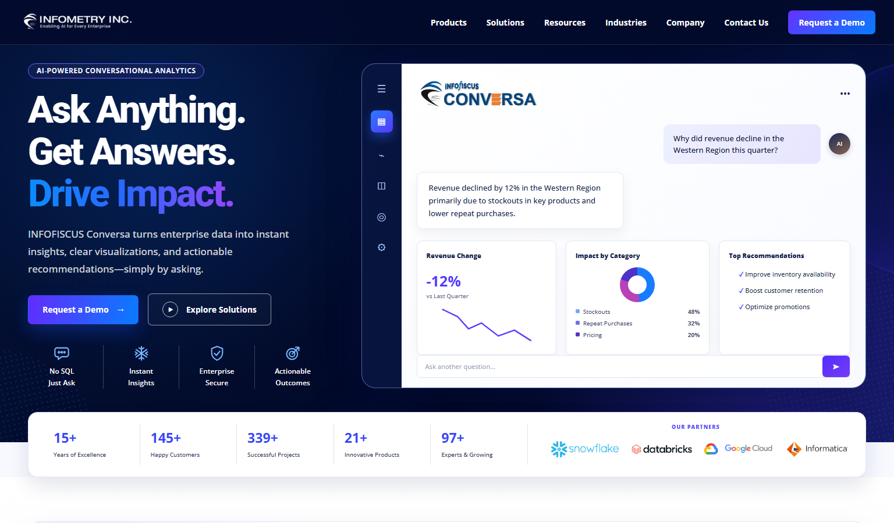

# Infometry Custom Templates

WordPress plugin containing the Infometry homepage, INFOFISCUS Conversa,
Informatica Connectors, and Google Cloud Connectors page templates.
The repository root is the plugin root and is ready for Cloudways Git deployment.



## Repository contents

- `infometry-custom-templates.php` — main WordPress plugin bootstrap.
- `templates/page-home-design-test.php` — “Home Design Test” page template.
- `templates/page-infofiscus-conversa.php` — “INFOFISCUS Conversa Product” page template.
- `templates/page-informatica-connectors.php` — “Informatica Connectors Product” page template.
- `templates/page-google-cloud-connectors.php` — “Google Cloud Connectors Product” page template.
- `assets/css/` and `assets/js/` — template-scoped frontend assets.
- `assets/images/` — local design and brand assets.
- `preview-full.html` — standalone local preview of the complete homepage.
- `preview-conversa.html` — standalone local preview of the Conversa page.
- `preview-informatica.html` — generated standalone preview of the Informatica Connectors page.
- `tools/` — preview generation and pre-deployment verification scripts.
- `docs/homepage-preview.png` — current desktop preview.

## WordPress installation

1. Clone or deploy this repository to
   `wp-content/plugins/infometry-custom-templates/` on staging.
2. Activate **Infometry Custom Templates** in WordPress.
3. On the homepage, select **Home Design Test** under Page Template.
4. On the Conversa product page, select **INFOFISCUS Conversa Product**.
5. On the Informatica product page, select **Informatica Connectors Product**.
6. On the Google connectors page, select **Google Cloud Connectors Product**.
7. Update/preview all four pages and clear caches if needed.

Version 2.3.0 automatically recognizes the live Informatica and Google Cloud
Connectors routes at `/product/informatica-connectors/` and
`/product/google-cloud-connectors/`; the other templates remain explicitly selected.
The plugin loads each
template and its isolated CSS/JavaScript only when that template is selected.
It does not modify WordPress core, BeTheme files, Theme Options, or the database.

## Cloudways Git deployment

Configure the deployment path so the repository root lands directly in:

```text
public_html/wp-content/plugins/infometry-custom-templates/
```

Do not deploy the repository into `public_html/` itself. Deployment only copies
plugin files; activation and template selection remain explicit staging actions.

## Local preview

Serve the repository root with any static HTTP server, for example:

```bash
python -m http.server 4189
```

Then open:

- `http://127.0.0.1:4189/preview-full.html`
- `http://127.0.0.1:4189/preview-conversa.html`
- `http://127.0.0.1:4189/preview-informatica.html`

Regenerate the Informatica preview after changing its PHP template:

```bash
php tools/render-informatica-preview.php
```

Run the complete local pre-deployment check from PowerShell:

```powershell
.\tools\verify-project.ps1 -RegenerateInformaticaPreview
```

The same verification runs automatically in GitHub Actions on every push and
pull request.
